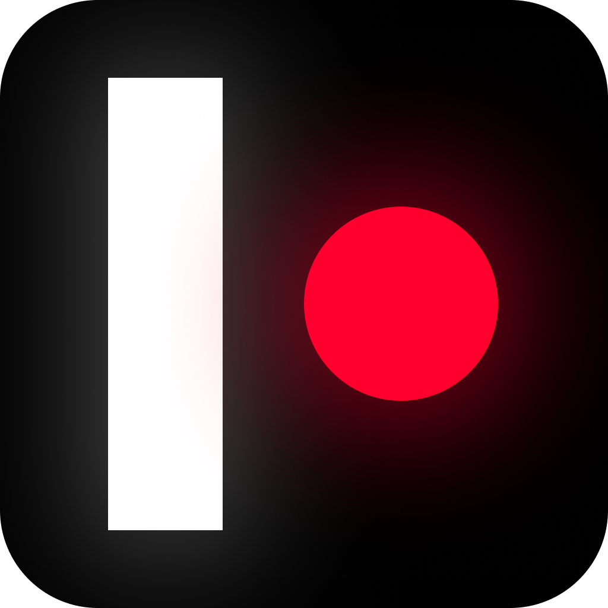

  

<samp><h6 align="center">#godot, #gamedev, #v3</h6></samp>
<samp><h1 align="center">Pong</h1></samp>

<h6 align="center"><samp>Classic Ping-Pong game implementation using Godot engine v3.</samp></h6>

  

<kbd></kbd>

<a href="https://github.com/alexrintt/pong/releases"><h4 align="center"><samp>Download It</samp></h4></a>

 

##  Ping-Pong

In the doubt take the classic one.

This is my first touch with Godot engine (v3).

To run locally, install [Godot engine v3.x](https://godotengine.org/download), open project list then import this project (`./project.godot` file).

## Controls

Take a look how to controls the game mode and settings.

### Left Player (Player 1)

- <kbd>W</kbd> up.
- <kbd>S</kbd> down.

### Right Player (Player 2)

- <kbd>Arrow Up</kbd> up.
- <kbd>Arrow Down</kbd> down.

### Settings

- <kbd>1</kbd> set _acceleration mode_ (Up and down are now based on acceleration).
- <kbd>2</kbd> set _linear mode_ (Up and down are now based on a constant velocity).
- <kbd>R</kbd> resets the counter.

  

<samp>

<h2 align="center">
  Open Source
</h2>

  Copyright © 2022-present, Alex Rintt.

Pong <a href="https://github.com/alexrintt/pong/blob/master/LICENSE">is MIT licensed 💖</a>

  

  
</samp>
